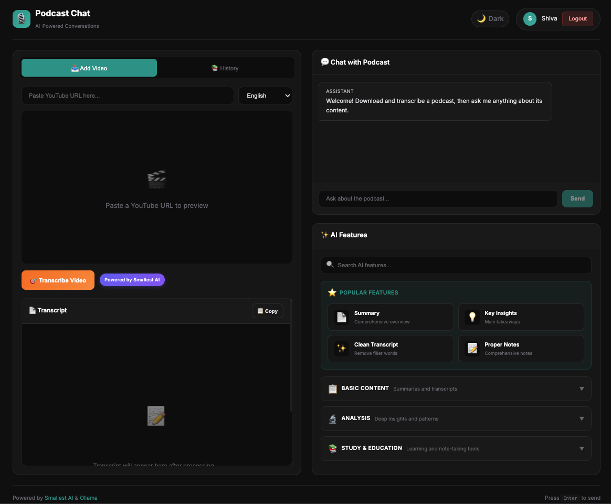
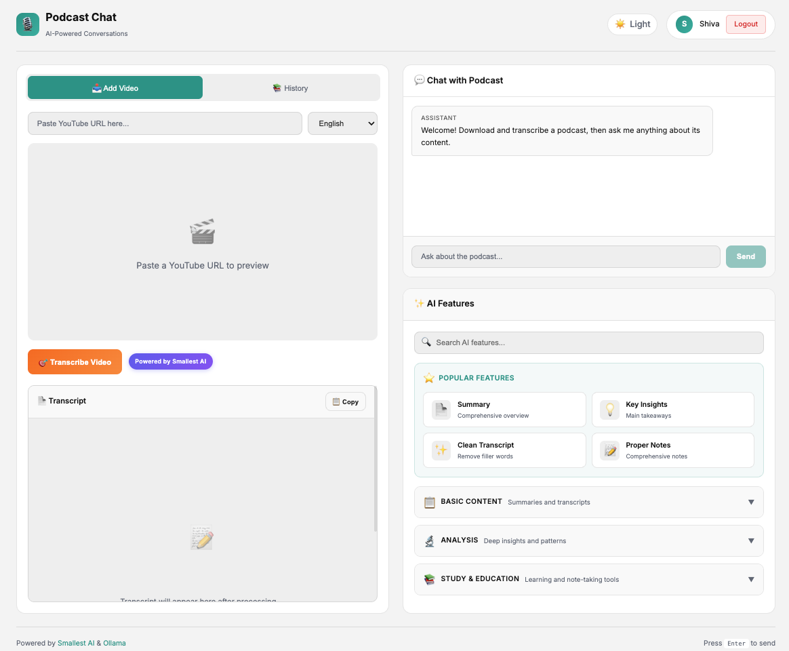

# 🎙️ Podcast Chat

> **AI-Powered Podcast Conversations** — Download any YouTube podcast, transcribe it with AI, and have intelligent conversations about the content.

[](https://python.org)
[](https://flask.palletsprojects.com)
[](LICENSE)
[](https://smallest.ai/)

---

## 🎨 Screenshots

<div align="center">

| Dark Mode | Light Mode |
|-----------|------------|
|  |  |

</div>

## ✨ Features

| Feature | Description |
|---------|-------------|
| **YouTube Download** | Paste any YouTube URL with live video preview |
| **One-Click Transcribe** | Single "Transcribe Video" button downloads and transcribes automatically |
| **Progress Tracking** | Beautiful animated progress bar showing download and transcription status |
| **Intelligent Chat** | Ask questions and get contextual answers from podcast content |
| **20+ AI Features** | Summary, flashcards, Q&A, notes, insights, and more — all powered by Ollama |
| **History Management** | Save and revisit your transcribed podcasts with History tab |
| **Dark/Light Mode** | Toggle between dark and light themes with persistent preference |
| **User Authentication** | Secure email-based login with per-user history |
| **Multi-language** | English, Spanish, French, German, Hindi, Portuguese, Italian |
| **Smart Chunking** | Dynamic audio chunking based on video length for optimal processing |

---

## 🚀 Quick Start

### Prerequisites

- **macOS** 10.15+, **Windows** 10/11, or **Linux** (Ubuntu 20.04+)
- **Python** 3.10+
- **FFmpeg** (auto-installed on macOS, manual on Windows/Linux)
- **Ollama** (auto-installed on macOS, manual on Windows/Linux)

### Installation

```bash
# Clone the repository
git clone https://github.com/ShivashishY/Podcast_Chat.git
cd podcast-chat

# Create virtual environment
python3 -m venv .venv
source .venv/bin/activate

# Install dependencies
pip install -r requirements.txt

# Configure environment
cp .env.example .env
# Edit .env and add your SMALLEST_API_KEY
```

### Get Your API Key

1. Go to **[smallest.ai](https://smallest.ai)** and create an account
2. Navigate to **API Keys** section
3. Create a new key and add it to your `.env` file:
   ```env
   SMALLEST_API_KEY=sk_your_api_key_here
   ```

### Run the App

```bash
python app.py
```

Open **http://localhost:5000** in your browser.

### One-Click Start

| Platform | Launcher | How to Run |
|----------|----------|------------|
| **macOS** | `Start Podcast Chat.command` | Double-click the file |
| **Windows** | `Start Podcast Chat.bat` | Double-click the file |
| **Linux** | `start-linux.sh` | Run `./start-linux.sh` in terminal |

The launchers automatically:
- Install dependencies if missing
- Create virtual environment
- Download Ollama model (first run)
- Start the application

---

## 💡 How to Use

### 1️⃣ Paste & Preview
Paste a YouTube URL — a live video preview appears instantly

### 2️⃣ Transcribe  
Click **Transcribe Video** — the progress bar shows download (0-50%) and transcription (50-100%)

### 3️⃣ Chat & AI Features
Ask any question about the podcast content, or use one of the 20+ AI features!

**Example Questions:**
- "What was the main topic discussed?"
- "Summarize this podcast in 3 bullet points"
- "What did the guest say about [topic]?"
- "When did they talk about [subject]?"

### 4️⃣ AI Features
After transcription, access the AI Features panel with collapsible categories:

| Category | Features |
|----------|----------|
| **Popular** | Summary, Key Insights, Clean Transcript, Proper Notes |
| **Basic Content** | Micro Summary, Short Summary, Bullet Points, Notable Quotes |
| **Analysis** | Extract Ideas, Extract Insights, Extract Patterns, Extract Wisdom |
| **Study & Education** | Flashcards, Concept Map, Q&A, Outline Notes, Cornell Notes, Rapid Logging, T-Note Method, Charting Method, QEC Method, Q&A Split Page |

---

## ⚙️ Configuration

### Environment Variables

| Variable | Required | Default | Description |
|----------|----------|---------|-------------|
| `SMALLEST_API_KEY` | ✅ Yes | - | API key from smallest.ai |
| `FLASK_DEBUG` | No | `false` | Enable debug mode |
| `PORT` | No | `5000` | Server port |
| `OLLAMA_URL` | No | `localhost:11434` | Ollama server URL |
| `OLLAMA_MODEL` | No | `llama3.2` | LLM model to use |

### Smart Audio Processing

The app handles any length video by:
- Compressing audio to mono 16kHz for efficient processing
- Splitting into 60-second chunks to stay under API limits
- Seamlessly stitching transcripts with accurate timestamps

---

## 🏗️ Project Structure

```
podcast_chat/
├── app.py                    # Main Flask application
├── auth.py                   # Authentication module
├── models.py                 # Database models
├── templates/                # HTML templates
│   ├── index.html            # Main app interface
│   ├── login.html            # Login page
│   └── signup.html           # Signup page
├── downloads/                # Downloaded audio (gitignored)
├── transcripts/              # Saved transcripts (gitignored)
├── docs/                     # Documentation
├── requirements.txt          # Python dependencies
├── .env.example              # Environment template
├── setup.sh                  # Setup script (macOS/Linux)
├── start.sh                  # Start script (macOS/Linux)
├── start-linux.sh            # One-click launcher (Linux)
├── Start Podcast Chat.command # One-click launcher (macOS)
└── Start Podcast Chat.bat    # One-click launcher (Windows)
```

---

## 🎨 Design

Modern two-column layout with dark/light mode support:

| Element | Dark Mode | Light Mode |
|---------|-----------|------------|
| Primary Accent | `#2B9D90` (Teal) | `#2B9D90` (Teal) |
| Background | `#0d0d0d` | `#f5f5f5` |
| Cards | `#161616` | `#ffffff` |
| Text | `#e4e4e7` | `#1f1f1f` |

**UI Highlights:**
- Dark/Light mode toggle with persistent preference
- YouTube video preview in left column
- Animated progress bar with step indicators
- Collapsible AI feature categories
- History tab for past transcriptions, which can be reused without processing again
- Chat + AI features in right column

---

## 🔒 Security Features

- ✅ Password hashing with Werkzeug
- ✅ Session management via Flask-Login
- ✅ Auto-generated secret key (no manual configuration)
- ✅ Per-user data isolation
- ✅ CSRF protection
- ✅ SQLite database for user storage

---

## ❓ Troubleshooting

<details>
<summary><strong>"Cannot connect to Ollama"</strong></summary>

```bash
# Start Ollama manually
ollama serve
```
</details>

<details>
<summary><strong>"AI Model Not Found"</strong></summary>

```bash
# Pull the required model
ollama pull llama3.2
```
</details>

<details>
<summary><strong>"Transcription Failed"</strong></summary>

- Verify your Smallest AI API key in `.env`
- Check your internet connection
- Long podcasts (>1hr) may take several minutes
</details>

<details>
<summary><strong>"App Won't Start"</strong></summary>

```bash
# Re-run setup
./setup.sh

# Or manually install dependencies
pip install -r requirements.txt
```
</details>

---

## 💾 System Requirements

| Requirement | macOS | Windows | Linux |
|-------------|-------|---------|-------|
| OS Version | 10.15+ | 10/11 | Ubuntu 20.04+ |
| Python | 3.10+ | 3.10+ | 3.10+ |
| RAM | 4GB (8GB recommended) | 4GB (8GB recommended) | 4GB (8GB recommended) |
| Storage | 5GB | 5GB | 5GB |
| FFmpeg | Auto-installed | Manual install | `apt install ffmpeg` |
| Ollama | Auto-installed | Manual install | `curl -fsSL https://ollama.ai/install.sh \| sh` |

---

## 🤝 Contributing

Contributions are welcome! Please read our [Contributing Guide](CONTRIBUTING.md) for details on:

- Setting up the development environment
- Code style guidelines
- Submitting pull requests

---

## 📄 License

This project is licensed under the MIT License - see the [LICENSE](LICENSE) file for details.

---

## 🙏 Powered By

- **[Smallest AI](https://smallest.ai)** — Pulse STT for transcription (displayed as "Powered by Smallest AI" badge)
- **[Ollama](https://ollama.ai)** — Local AI inference for chat & 20+ AI features
- **[yt-dlp](https://github.com/yt-dlp/yt-dlp)** — YouTube downloads
- **[Flask](https://flask.palletsprojects.com)** — Web framework

---

<p align="center">
  Made with ❤️ for podcast lovers
  <br><br>
  <a href="https://github.com/ShivashishY/Podcast_Chat/issues">Report Bug</a>
  ·
  <a href="https://github.com/ShivashishY/Podcast_Chat/issues">Request Feature</a>
</p>
